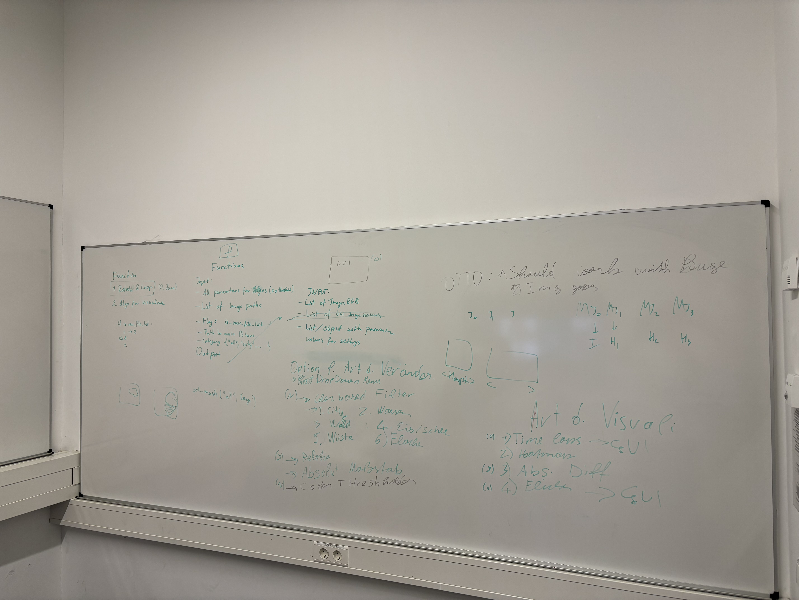

# Computer_vision_challenge

# Software interface description

As functions we describe the matlab functions that in rough form: take the raw RGB images, and output the modified images that are ready to be displayed.

## GUI

### Function return values to GUI:

- List of image objects
    Ready to be displayed on screen (mostly RGB)

- matlab struct containing the relevant parameter for the advanced settings in the GUI \
    The GUI must have "agreed" with the function on which parameters are relevant in the function \
    For eg. one function might need only threshold, the other one threshold and sensitivity, etc.

## Type of visualization

- Time lapse - done by UI (@Orhun)

- Heatmap - function needed

- Absolute differences - marked in red over threshold (@Jakub)

- Flicker - comparisons between two images - done in GUI (@Orhun)


## Type of changes

- Category - one of the allowed change categories (str). Currently available:
    - all
    - city
    - water
    - forrest
    - ice
    - desert
    - farmland (?)

- Change evaluation - counting pixels
    - Relative
    - Absolute


## Functions

### Inputs:

- List of absolute image paths  (list[Path | str])

- Path to main picture - this picture will be used as reference for rotation and change computation

- is_new_file_list - flag, if set to true, then the image will be realigned - requires more computation (boolean)

- Category - one of the allowed change categories (str).

- Function parameters - all parameter the function needs to do its job (struct)
    For eg.
    ```matlab
    inputParams.threshold   = 0.1
    inputParams.sensitivity = 0.5
    ```


### Outputs:

See the [GUI section](#gui) for detailed information about the outputs and their usage in the graphical interface.


### Example of a function call:

``` matlab
    % Example function call
    image_paths = {
        '/path/to/image1.jpg',
        '/path/to/image2.jpg', 
        '/path/to/image3.jpg'
    };
    main_picture_path = '/path/to/reference_image.jpg';
    is_new_file_list = true;
    category = 'city';
    
    % Function parameters struct
    inputParams.threshold = 0.1;
    inputParams.sensitivity = 0.5;
    inputParams.rotation_tolerance = 2.0;
    inputParams.change_detection_method = 'histogram';
    
    % Function call (example)
    [processed_images, gui_params] = processChangeDetection(...
        image_paths, ...
        main_picture_path, ...
        is_new_file_list, ...
        category, ...
        inputParams);
    
    % Return values:
    % processed_images: cell array of RGB image objects ready for display
    % gui_params: struct containing relevant parameters for GUI advanced settings
    %   gui_params.threshold
    %   gui_params.sensitivity  
    %   gui_params.detected_changes
    %   gui_params.confidence_scores
```


### High-Level function pattern

```matlab
function [processed_images, gui_params] = processChangeDetection(image_paths, main_picture_path, is_new_file_list, category, inputParams)

1. INPUT VALIDATION
   - Validate image_paths list
   - Verify main_picture_path exists
   - Check category is valid ('all', 'city', 'water', 'forrest', 'ice', 'desert', 'farmland')
   - Validate inputParams structure

2. IMAGE PREPROCESSING
   if is_new_file_list == true:
        - Prepare the images using function by @Otto and @Juan
   else:
       - Load existing preprocessed image objects from context
   endif

3. CATEGORY-BASED MASK GENERATION
   - Get the mask for each image from the utility function for mask generation

4. CHANGE DETECTION ALGORITHM
   - Run change detection algorithm on masked images
   - Use inputParams (threshold, sensitivity, etc.) to configure detection
   - Compare images against reference (main_picture)

5. STATISTICS CALCULATION
   - Calculate the statistics for the relevant masked areas

6. OUTPUT PREPARATION
   - Convert processed images to proper format ready for GUI display (mostly RGB)
   - Populate gui_params struct with:
     * All relevant parameters for GUI advanced settings
     * Statistics
   - Return [processed_images, gui_params]

end function
```


# Photo from meeting 1
